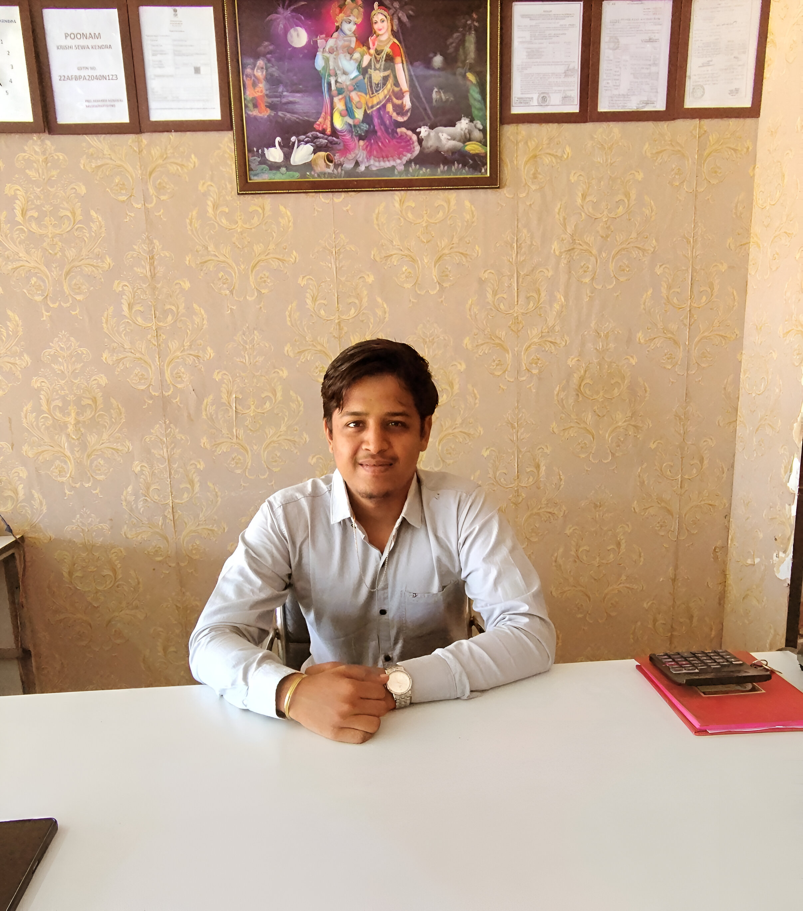

<!DOCTYPE html>
<html lang="en">
<head>
  <meta charset="UTF-8" />
  <meta name="viewport" content="width=device-width, initial-scale=1.0" />
  <title>Nitish Agrawal – CA Finalist</title>

  <!-- Meta & Favicon -->
  <link rel="icon" href="profile.jpg" type="image/jpeg">
  <meta name="description" content="Nitish Agrawal – CA Finalist specializing in taxation, GST, and auditing.">
  <meta property="og:title" content="Nitish Agrawal – CA Finalist">
  <meta property="og:description" content="CA Finalist passionate about taxation, auditing, and business compliance.">
  <meta property="og:image" content="https://nattu304.github.io/nitishagrawaldetails/profile.jpg">
  <meta name="theme-color" content="#0073e6">

  <!-- Google Fonts -->
  <link href="https://fonts.googleapis.com/css2?family=Poppins:wght@400;500;600&display=swap" rel="stylesheet">

  
</head>
<body>
  

    

      
    

    <h1>Nitish Agrawal</h1>
    
CA Finalist | Vaada & Associates

    
Helping businesses grow with clarity & compliance.

    

    

      <h2>Contact</h2>
      

        📞 <a href="tel:+917828780780">+91 78287 80780</a> 
        ✉️ <a href="mailto:nitishagrawal304@gmail.com">nitishagrawal304@gmail.com</a> 
        📍 Baloda, Saraipali, Mahasamund, Chhattisgarh 493558
      

      

        <a href="https://wa.me/917828780780?text=Hello%20Nitish%20Agrawal" class="btn btn-whatsapp">WhatsApp</a>
        <a href="NITISHAGRAWAL.VCF" class="btn">Download vCard</a>
        <a href="https://instagram.com/nattu.780" class="btn btn-instagram">Instagram</a>
        <a href="https://wa.me/?text=Check%20out%20Nitish%20Agrawal’s%20profile:%20https://nattu304.github.io/nitishagrawaldetails" class="btn btn-share">Share My Card</a>
      

    

    

      <h2>About Me</h2>
      

        CA Finalist passionate about taxation, auditing, and helping businesses stay compliant while growing confidently.
      

      
<strong>Birthday:</strong> 2nd April 2002

    

    

      <h2>Professional Services</h2>
      

        
📄 ITR Filing

        
💰 GST Returns

        
📊 Audit

        
🏢 Consultancy

      

    

    

      <h2>Business Ventures</h2>
      <ul>
        <li>Poonam Kapda Dukan</li>
        <li>Poonam Bartan Dukan</li>
        <li>Poonam Krishi Sewa Kendra</li>
      </ul>
    

    

      <h2>Scan for UPI Payment</h2>
      
      
Scan using any UPI app (PhonePe, GPay, Paytm)

    

    <footer>
      © 2025 Nitish Agrawal | All Rights Reserved
    </footer>
  

</body>
</html>
